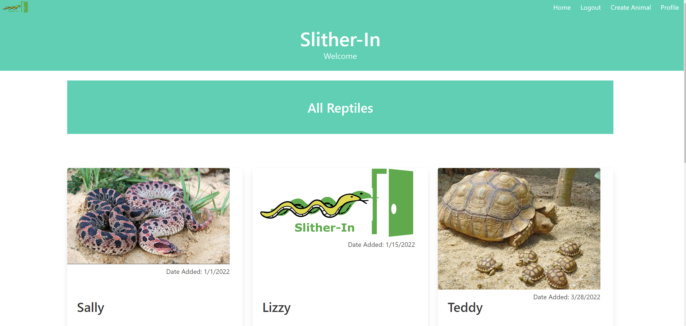
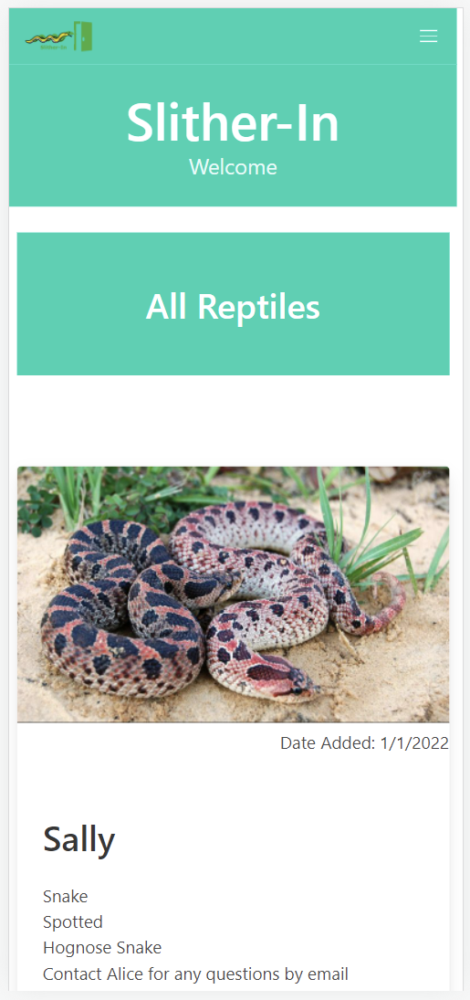

  # Slither-In

  ----
  

  ----

### Description
This is a reptile database where you can keep track of multiple species of reptiles you own as well as information about them. Such as "Age" "Sex" "Morph" and so on. 

## Table of Contents
- [Installation](#installation)
- [Usage](#usage)
- [Pictures](#pictures)
- [License](#license)
- [Contribution](#contribution)
- [Test Instructions](#test-instructions)
- [Questions](#questions)

### Installation
Clone or download the repo.  You will also need to install and download node.js and Insomnia to run and test the program.

### Usage
Run npm install in node.   Log into mysql and source db/schema.sql.   Run npm seed in node.  Run npm start or node server.js in your node terminal.  Then check your routes via your favorite browser or Insomnia. 

### Pictures
 
 

### License
MIT
https://choosealicense.com/licenses/mit/

### License Details

MIT License

### Contribution
niccolosaurus (Niccolo Eck)   CarlosCastillo123 (Carlos Castillos)   Seyaryu (Daniel Holland)   JayMoses01 (Jay Moses)  

### Questions
[Github Profie](https://github.com/niccolosaurus)  
nicco.eck@gmail.com  
https://slither-in.herokuapp.com/  